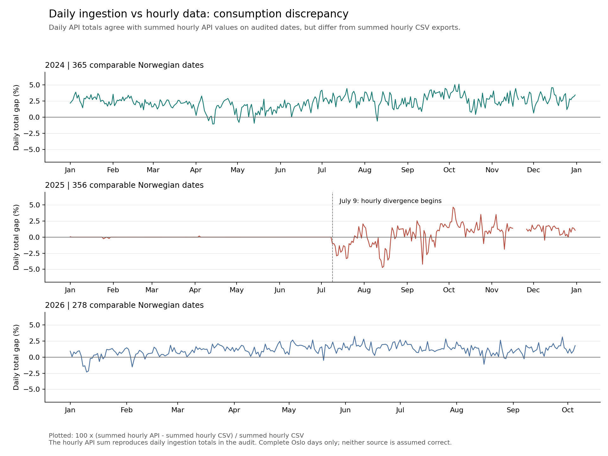

# Oslo Energy

A learning project building a reproducible electricity-data foundation for future consumption forecasting. Statnett is the provider; coverage is **Norway**, not Oslo or NO1 alone.

## Current Status

Implemented: hourly API fetching, raw JSON archival, DST-safe normalization, quality reports, offline replay, discrepancy research and opt-in provenance-preserving PostgreSQL persistence.

```text
Hourly API -> raw archive -> normalization -> candidate CSVs + quality report -> optional PostgreSQL persistence
```

Missing measurements remain missing. Completed, incomplete and future periods are separated using the original fetch time. Persistence writes completed hourly candidates and audits corrections; reports and database runs retain `training_ready: false`. Provider units, independent accuracy and training eligibility remain unresolved.

**Later:** analytical cleaning, features and models. Those stages are not implemented.

## Quickstart

Use Python 3.10 or newer. From the repository root:

```bash
python -m venv .venv
source .venv/bin/activate
python -m pip install -e '.[dev]'
```

Fetch, archive and normalize hourly data:

```bash
python -m oslo_energy.pipeline.run_ingestion --from-date 2005-01-01 --normalize
```

The start defaults to `2005-01-01`. Omit `--normalize` for fetch-and-archive only. Runtime files go to ignored `data/raw/statnett/` and `data/normalized/statnett/`. No database or Docker service is required.

Replay an existing archive without a network request:

```bash
python -m oslo_energy.pipeline.run_ingestion \
  --replay path/to/raw.json \
  --fetched-at 2026-10-06T00:56:03.832107Z \
  --output-dir data/normalized/statnett
```

Use the original archive path and timezone-aware fetch timestamp, not replay time. The filename records its UTC fetch time. Replay supports hourly and legacy daily snapshots. Run `python -m oslo_energy.pipeline.run_ingestion --help` for all options and see the [system reference](docs/oslo_energy_data_normalization_cleaning_pipeline.md) for output contracts.

## Optional Persistence

PostgreSQL writes are opt-in. Start the local service, apply the additive migration once, then enable persistence on a normalized live run:

```bash
docker compose up -d postgres
python -m oslo_energy.database.migrate
python -m oslo_energy.pipeline.run_ingestion --normalize --persist
```

Replay can also use `--persist`; it retains the supplied original `--fetched-at` cutoff. A failed database write returns nonzero but keeps the raw archive and normalized files. Persistence does not certify values for training. See the [persistence design](docs/database-design.md) for timestamp ordering, revisions and database test instructions.

## Source Choice and Findings

We already used the API; the investigation prompted a switch from **daily API ingestion to hourly API ingestion**, not from CSV to API.

| Comparison for the same Norwegian day | Finding |
| --- | --- |
| Daily API ingestion vs summed hourly API values | Exact agreement on audited dates |
| Daily API ingestion vs summed hourly CSV exports | Consumption and production differences |

Hourly API observations are our **canonical source of truth** for future aggregates, features and training datasets. They expose missing hours and make aggregation auditable. This is an architectural choice, not proof that the API is independently correct. CSV exports remain comparison evidence, not interchangeable training inputs.



The chart compares daily ingestion with summed hourly exports on 999 complete local days. Its daily API side is reconstructed from hourly API sums and verified against the original daily archive. The [research document](docs/statnett_hourly_source_decision.md) owns the detailed evidence, coverage rules and unresolved causes, including the suspected export scaling problem.

Reproduce the research with optional plotting dependencies:

```bash
python -m pip install -e '.[dev,research]'
python -m oslo_energy.pipeline.compare_consumption
```

## Documentation

| Document | Purpose |
| --- | --- |
| [System and Pipeline](docs/oslo_energy_data_normalization_cleaning_pipeline.md) | Implemented components, contracts, outputs, replay and failure behavior |
| [Source Decision and Research](docs/statnett_hourly_source_decision.md) | Findings, visualization, source-selection rationale and open provider questions |
| [Persistence Design](docs/database-design.md) | Implemented schema, migration, integrity, revisions and opt-in commands |

Runtime code lives under [src/oslo_energy](src/oslo_energy/); tests under [tests](tests/). Keep system contracts in the system reference, new measurements in the research document and storage details in the persistence design.

## Testing

```bash
python -m pytest
python -m compileall -q src/oslo_energy
```

The ordinary tests use mocked HTTP, temporary directories and saved examples; real network access and PostgreSQL are not required. Explicit PostgreSQL integration tests are documented in the [persistence design](docs/database-design.md).

## License and Sources

Project source code and original documentation are covered by the [MIT License](LICENSE). That license does not apply to Statnett data, its API, or third-party material, including the archived examples. Confirm applicable provider terms before redistribution or production use.

- [Statnett operational data](https://driftsdata.statnett.no/)
- [Statnett timestamped downloads and source definitions](https://driftsdata.statnett.no/Web/Download/)
